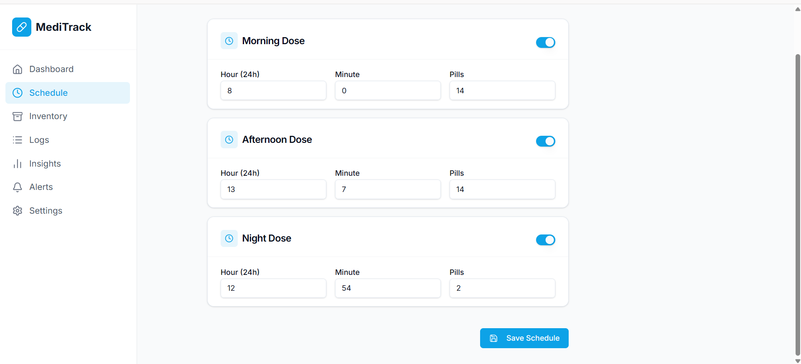
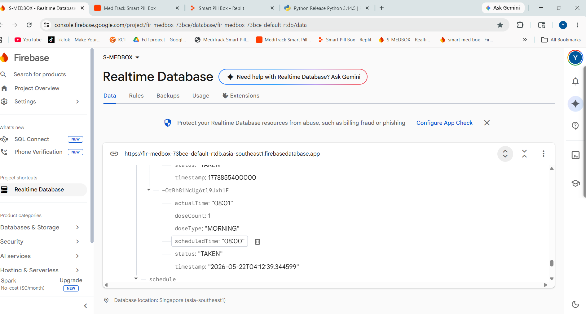

# Smart Pill Box

An Arduino-based IoT medication reminder prototype that combines scheduled reminders, local user interaction, medicine inventory tracking, and cloud-based monitoring.

## Overview

The Smart Pill Box is designed to remind users to take scheduled medication and record medication-related activity.

The system combines an Arduino-based hardware unit with an RTC for time-based scheduling, local indicators for reminders, and a cloud-connected dashboard for monitoring schedules, inventory, and logs.

## Features

* Scheduled medication reminders
* Real-time clock-based scheduling using an RTC module
* LCD display for status information
* LED and buzzer alerts
* Push-button interaction for medication confirmation
* Medication inventory tracking
* Low-stock indication
* Medication logs
* Cloud-based data storage using Firebase
* Web dashboard for viewing schedules, inventory, and logs
* Serial communication between the hardware and connected system

## How It Works

The system uses an RTC module to maintain the current time and trigger medication reminders according to the configured schedule.

When a scheduled medication time is reached:

1. The Arduino checks the configured schedule.
2. The LCD displays the relevant reminder.
3. The LED and buzzer provide a local alert.
4. The user can interact with the system using the push button.
5. The medication status and inventory information can be updated.
6. Relevant information is communicated to the connected cloud system.
7. The web dashboard can be used to monitor schedules, inventory, and logs.

## System Overview

```text
RTC Module
    ↓
Arduino
    ↓
Medication Schedule
    ↓
LCD + LED + Buzzer
    ↓
User Confirmation
    ↓
Serial Communication
    ↓
Firebase
    ↓
Web Dashboard
```

## Hardware

* Arduino
* RTC module (DS3231)
* LCD display
* LED
* Buzzer
* Push button
* Medication storage compartments
* Connecting wires and supporting components

## Software & Technologies

* C / Arduino
* Arduino IDE
* Python
* Firebase Realtime Database
* HTML / CSS / JavaScript
* Replit deployment for the web interface

## Project Structure

```text
smart-pill-box/
│
├── arduino/
│   ├── smart_pill_box.ino
│   └── rtc_time_setup.ino
│
├── app/
│   └── ...
│
├── demo/
│   └── smart-pillbox-demo.mp4
│
└── README.md
```

## Dashboard

The project includes a web dashboard for monitoring the system.

### Schedule

View and manage medication schedules.

### Inventory

Monitor the available medication quantity.

### Logs

View recorded medication-related events.

## Screenshots

### Schedule



### Inventory


### Logs


### Firebase Database



## Demo

A demonstration video of the Smart Pill Box is included in the `demo` directory.

## Limitations

This project is a prototype and is not intended to replace professional medical devices or medication-management systems.

The system depends on its configured hardware, software, and cloud environment. Reliability may also be affected by connectivity and hardware limitations.

## What I Learned

Through this project, I gained practical experience with:

* Embedded programming using Arduino
* RTC-based scheduling
* Event-driven hardware interaction
* Non-blocking timing using `millis()`
* Serial communication
* Basic IoT architecture
* Firebase-based data storage
* Web dashboard integration
* Hardware and software integration

## Future Improvements

Potential improvements include:

* Mobile notifications
* Improved offline operation
* More robust medication tracking
* Better hardware enclosure
* Improved user interface
* More reliable synchronization between the device and cloud system

## Disclaimer

This project is an educational prototype developed for learning purposes. It should not be relied upon for critical medication management or medical decisions.
